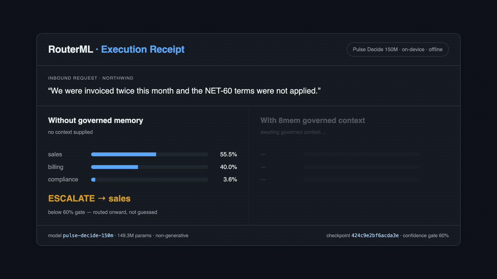

<div align="center">

# RouterML

### Route every request to the cheapest capable path — and escalate when unsure.

[](https://huggingface.co/RouterML/pulse-decide-150m)
[](LICENSE)
[](NOTICE)
[](requirements.txt)



</div>

---

Most production "decisions" are not writing tasks. *Which team owns this ticket? Is this
request in scope? Which tool should run?* Sending those to a large generative model is slow,
costs money per call, and ships your data off the machine.

RouterML is the routing layer for that problem: **send each request to the cheapest path
that can actually handle it, and escalate the rest.**

This repository ships its decision model, **Pulse Decide 150M** — 149.3M parameters,
running on your own hardware. It doesn't generate text; it **scores** each candidate option
against the input, returns the best one with a confidence, and **escalates instead of
guessing** when it isn't sure.

```
"We were invoiced twice and the NET-60 terms were not applied."
  → billing   93%   ACT       ~30 ms, on-device, no network call
```

## Why it's small

A generative model has to learn to *produce* language. Pulse only has to *judge fit* —
a far smaller job. That's the whole reason 150 MB is enough where generation needs
billions of parameters.

|  |  |
|---|---|
| **Size** | 149.3M params · 570 MB fp32 · ~150 MB int8 |
| **Latency** | ~30–40 ms per decision on CPU |
| **Cost** | $0 per decision — nothing leaves the device |
| **Options** | supplied per request, so label sets it never trained on still work |
| **Output** | `label` · `confidence` · `escalate` — never a silent guess |

## Quickstart

```bash
pip install -r requirements.txt
python demo/quickstart.py
```

```python
from pulse.model import PulseConfig, PulseUnified, load_tokenizer

label, confidence = decide(
    state    = "We were invoiced twice this month and the agreed terms were not applied.",
    question = "Which team should handle this?",
    choices  = ["sales", "support", "billing", "success", "compliance"],
    context  = ["NET-60 payment terms", "prior billing dispute on file"],
)

if confidence < 0.60:
    escalate()            # don't act on a decision the model isn't sure about
```

`choices` are read at request time. Swap in a completely different label set and it still
works — no retraining, no fixed output classes.

## The part that matters: escalation

A confidence score is only useful if you act on it. Pulse returns one so you can split
traffic:

```
            ┌── confident ──→  act locally        ~30 ms,  $0
 request ───┤
            └── unsure    ──→  escalate           larger model, or a person
```

Easy decisions stay on the device. Only the genuinely hard ones cost anything. Measured
accuracy, coverage and calibration for the released checkpoint are reported **with their
conditions** on the [model card](https://huggingface.co/RouterML/pulse-decide-150m) —
a confidence score is statistical reliability on a distribution, not proof that any single
prediction is correct.

## Serve it

```bash
python -m pulse.serve.cli --ckpt pulse_decide_150m.pt serve --port 8088
```

> `--ckpt` is a top-level flag — it goes **before** the subcommand.

```bash
curl -s -X POST http://127.0.0.1:8088/v1/decide \
  -H 'Content-Type: application/json' \
  -d '{"state":"We were invoiced twice this month.",
       "question":"Which team should handle this?",
       "choices":["sales","support","billing"],
       "context":["NET-60 payment terms"],
       "min_confidence":0.6}'
```

```json
{"label":"billing","confidence":0.93,"escalate":false,"latency_ms":32.5,
 "margin":0.87,"model":"pulse-decide-150m","top_k":[["billing",0.93],["sales",0.07]]}
```

When `escalate` is `true`, **do not act on `label`** — route the request onward.

## Bring your own context

`context` is just a list of strings, so any retrieval, RAG or memory layer can fill it.
Better context generally means a more confident decision, which means fewer escalations —
the GIF above is the same request decided with and without it.

## What's here

| Path | |
|---|---|
| `pulse/model.py` | model definition |
| `pulse/serve/` | decision engine, HTTP server, CLI |
| `demo/quickstart.py` | smallest working example |
| `demo/proof_card.py` | renders an execution receipt (HTML + GIF) |

Training code, datasets and evaluation harnesses are not part of this repository.

## Part of a stack

RouterML is one of three layers. Each works standalone — use one, two, or all three.

| | | |
|---|---|---|
| 🧠 **[8mem](https://github.com/tempomesh/8mem)** | **Memory** — governed agent memory: remembers context, safely. Selective retrieval, correction, forgetting, source lineage | live · [8mem.com](https://8mem.com) |
| 💾 **[DecaState](https://github.com/tempomesh/DecaState)** | **Measure + state** — forwards any AI call byte-for-byte, measures what it cost, reuses inference state | in development · [decastate.com](https://decastate.com) |
| ⚡ **RouterML** (here) | **Routing** — sends each request to the cheapest capable path: picks the option, reports confidence, escalates when unsure | research preview |

```
   context            state             decision
   ───────            ─────             ────────
    8mem      →     DecaState     →     RouterML
  what's true      what's cached      what to do now
```

They compose, but they are independently bounded — nothing here requires the others.
The `context` argument is a plain list of strings precisely so **any** memory layer can
fill it, ours or yours.

## Limitations

This is a **v0.1 research preview**. It has not been evaluated for fairness, safety or
robustness, and calibration degrades under distribution shift. Don't use it for
consequential decisions about people — employment, credit, housing, insurance, legal,
medical or safety-critical — without your own evaluation and human oversight. Read the
model card before relying on it.

## Contributing

Issues and PRs are welcome — especially:

- **Results on your own workload.** The escalation threshold is the main dial; what
  coverage/accuracy split works for you is genuinely useful information.
- **Failure cases.** A request where the model is confidently wrong is worth more to us
  than one it gets right.
- **Runtimes.** ONNX, int8, CoreML, GGUF — anything that makes it smaller or faster on
  more hardware.

No CLA, no gatekeeping. If something in the README is wrong or unclear, say so — that's a
valid issue too.

## Licence

Code is **Apache-2.0** (see [`LICENSE`](LICENSE)). **Weights are not** — they carry the
Pulse Research Preview Licence and were derived from datasets with differing terms; see
[`NOTICE`](NOTICE) and verify upstream licences before commercial use.

<div align="center">

**[Pulse Decide 150M on Hugging Face](https://huggingface.co/RouterML/pulse-decide-150m)**

</div>
